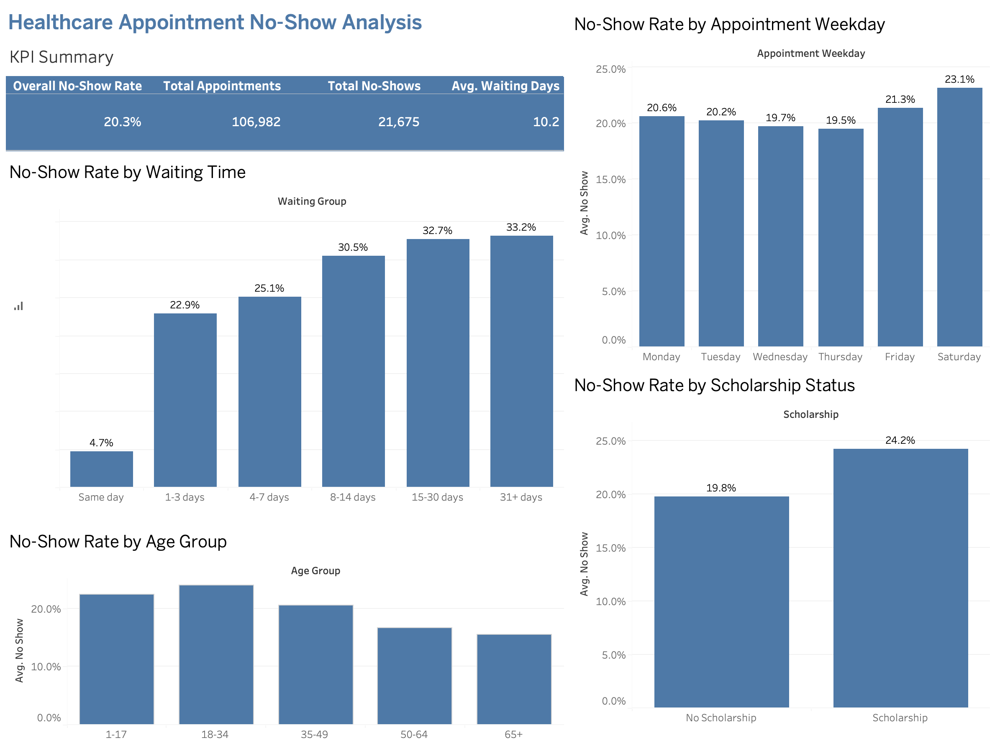

# Healthcare Appointment No-Show Analysis

## Project Overview

This project analyzes 106,982 healthcare appointments to identify factors associated with patient no-shows. The analysis explores appointment waiting time, age group, appointment weekday, and scholarship status.

## Tools Used

- Python and pandas for data cleaning
- Tableau for analysis and visualization
- GitHub for project documentation

## Dashboard

[View the interactive Tableau dashboard]([PASTE-YOUR-TABLEAU-PUBLIC-LINK-HERE)](https://public.tableau.com/app/profile/buket.deded/viz/Book1_17846593709960/Dashboard1)

## Key Findings

- The overall no-show rate was 20.3%.
- Same-day appointments had the lowest no-show rate at 4.7%.
- Appointments scheduled more than 30 days ahead had a no-show rate of 33.2%.
- Saturday had the highest weekday no-show rate at 23.1%.
- Patients ages 18–34 had the highest no-show rate among the age groups.
- Scholarship patients had a higher no-show rate than patients without scholarships.

## Recommendations

- Prioritize reminders for appointments booked far in advance.
- Consider additional outreach for Saturday appointments.
- Review scheduling practices that create long waiting periods.
- Investigate barriers affecting younger and scholarship patients.

## Dataset

The dataset contains appointment dates, patient characteristics, health conditions, SMS reminder status, neighborhood, and attendance outcomes.

## Author

Buket Dede
